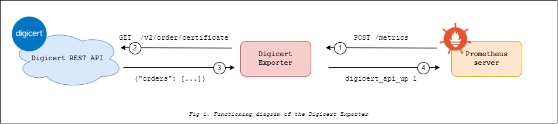

<p style="text-align: center;">
  <a href="https://go.dev"></a> 
  <a href="https://github.com/vareversat/digicert_exporter/actions"></a>
  <a href="https://github.com/vareversat/digicert_exporter/releases"></a>
  <a href="https://codecov.io/gh/vareversat/digicert_exporter/"></a>
</p>

# Digicert Exporter 🔥

Export [Digicert](https://www.digicert.com/) certificates information to [Prometheus](https://prometheus.io).

Metrics are computed by retrieving data using
the [Digicert REST API](https://dev.digicert.com/en/certcentral-apis/services-api/orders/list-orders.html).
Currently, the exporter use the `GET /v2/order/certificate` REST endpoint

## The genesis 🧠

The inception of this exporter originated during one of my professional assignments. We needed to determine the validity
of our Digicert certificates. While the Blackbox exporter already allows us to assess the validity of the certificate
installed on a website/API, we aimed to be alerted in advance of the upcoming certificate change. Implementing
certificate changes can be challenging on larger computer systems. Given that we were already operating a substantial
Prometheus stack, the idea to create this small exporter came to me.

## Prerequisites ✅

In order to run this exporter, you need :

1) A valid Digicert account **and** create an API
   key [here](https://www.digicert.com/secure/automation/api-keys/) with the **View Only** permission

2) **One of** these tool chains :
    - **Docker** (if you run only docker commands)
    - **Go v1.22** with **Make**  (if you prefer run Make & Go commands)

## How does it work ❓



Each time the Prometheus server will query the exporter via a `POST /metrics` the exporter will fetch the data from the
Digicert REST API.
It is important to keep in mind that the Digicert API has
a [rate limit](https://dev.digicert.com/en/certcentral-apis/services-api/rate-limits.html) of **1000reqs / 5min**
combined
with a short-term one of **100reqs / 5sec** so please set a scrape_interval as low as possible (30 min might be a good
start).

Here a working example of a Prometheus config for this exporter :

```yaml
scrape_configs:
  - job_name: 'digicert_exporter'
    scrape_interval: 30m
    static_configs:
      - targets: [ 'digicert_exporter:10005' ]
```

## Build & run ⚙️

Two ways of running the project :

- With go installed :

```shell
export DIGICERT_API_KEY=my-key && make run 
```

- With Docker installed :

```shell
docker build -t digicert_exporter . && docker run -e DIGICERT_API_KEY=my-key digicert_exporter
```

You may also build want to build the project via this command :

```shell
make build || make build-win
```

This command will generate an executable named `digicert_exporter.[o|exe]`

You may also want to start the whole Grafana/Prometheus stack. It's easy. Just run

```shell
make dev-stack
```

The Grafana instance is now reachable from `http://localhost:3000` with a `prometheus` datasource, a `grafana` dashboard
already
configured and some alerts via the `alertmanager` component

## Grafana, Prometheus & Alertmanager configuration 📁

You can find pre-made conf files for each of these components here :

- [Grafana dashboard](https://github.com/vareversat/blob/main/dev/grafana/digicert_exporter_dashboard.json)
- [Prometheus scrapping configuration](https://github.com/vareversat/blob/main/dev/prometheus/prometheus.yml#L11)
- [Alertmanager configuration](https://github.com/vareversat/blob/main/dev/prometheus/prometheus.yml#L4)

## Exporter's metrics 🧰

This exporter makes available a bunch of metrics related to Digicert but also to the exporter itself :

|                     Metric                      | Description                                      | Labels                                                                           | Notes                                                 |
|:-----------------------------------------------:|--------------------------------------------------|----------------------------------------------------------------------------------|-------------------------------------------------------|
|                `digicert_api_up`                | Was the last Digicert API<br/> query successful  | ❌                                                                                | ❌                                                     |
| `digicert_certificate_expire_timestamp_seconds` | Certificate expiration date                      | _certificate_common_name, <br/>certificate_id, <br/>order_id, <br/>organization_ | ❌                                                     |
|       `digicert_scrape_duration_seconds`        | Exporter scrape duration in seconds              | ❌                                                                                | ❌                                                     |
|  `promhttp_metric_handler_requests_in_flight`   | Current number of scrapes being served           | ❌                                                                                | Available with the<br/> `--web.exporter-metrics` flag |
|    `promhttp_metric_handler_requests_total`     | Total number of scrapes by HTTP<br/> status code | _code_                                                                           | Available with the<br/> `--web.exporter-metrics` flag |

## Flags 🇫🇷

You can show the available flags by running :

```shell
./digicert_exporter.o --help
```

Here a slightly more detailed list of them :

|                   Flag                    | Description                             | Default                                                  | Related environment variable       |
|:-----------------------------------------:|-----------------------------------------|----------------------------------------------------------|------------------------------------|
|                --log.level                | Logging level                           | `info`                                                   | ❌                                  |
|               --log.format                | Logging format                          | `logfmt`                                                 | ❌                                  |
|                 --version                 | Show application version                |                                                          | ❌                                  |
|             --web.listen-port             | Port used to run the exporter           | `:10005`                                                 | EXPORTER_PORT                      |
|            --web.metrics-path             | Path under which to expose metrics      | `/metrics`                                               | EXPORTER_PATH                      |
|              --digicert.url               | Digicert API URL used to fetch data     | `https://www.digicert.com/services/v2/order/certificate` | DIGICERT_URL                       |
|            --digicert.api-key             | Digicert API Key used to authentication | `""`                                                     | DIGICERT_API_KEY                   |
| --[no-]digicert.show-expired-certificates | Show expired certificate                | `false`                                                  | DIGICERT_SHOW_EXPIRED_CERTIFICATES |
|       --[no-]digicert.sandbox-mode        | Use mock.json test file                 | `false`                                                  | SANDBOX_MODE                       |
